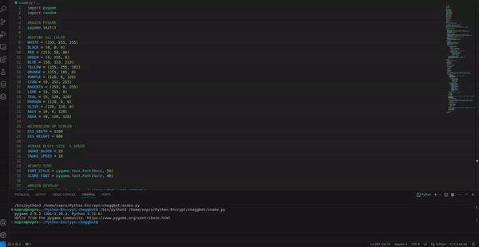

# Python-Snake-Game

A classic Snake Game implemented in Python using the Pygame library.



## Description

This Snake Game allows players to control a snake on a grid. The objective is to eat food items that randomly appear on the screen while avoiding collisions with the walls or the snake's own body. As the snake consumes food, it grows longer, making the game more challenging.

## Features

- User-friendly interface.
- Customizable username input.
- Dynamic scoring system.
- Responsive controls for snake movement.
- Randomized food placement for replayability.
- Game over screen with options to play again or quit.

## Requirements

- Python 3.x
- Pygame library

## Installation

1. Clone or download this repository.
2. Install Python 3.x if not already installed.
3. Install the Pygame library using pip:

    ```
    pip install pygame
    ```

## Usage

1. Navigate to the directory where the game files are located.
2. Run the game by executing the `snake_game.py` file:

    ```
    python snake_game.py
    ```

3. Follow on-screen instructions to enter your username and play the game.
4. Use the arrow keys to control the snake's movement.
5. Collect food items to increase your score.
6. Avoid colliding with walls or the snake's body to prevent game over.

## Screenshots

[Include screenshots or gifs of your game in action here.]

## Credits

- Developed by [Your Name or Team Name]
- Background image source: [Provide credit if applicable]

## License

[Include the license information for your project here.]

